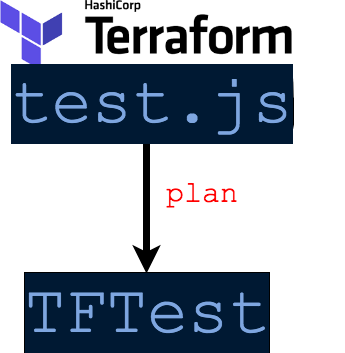

# tftest

## Why tftest?

CNI is heavily reliant on terraform modules and we create the module for the
other teams to use. In order to assure that the modules will do what it needs
to without applying the code ourselves we created the tftest framework. This
is specially important to check that the module will not destroy existing
infrastructure.

## Workflow

### With Modules


> To implement tests on both module and the implementation of module. If we have properties that are tested using args.

### Without Modules


> To implement test on just the module if we dont have any properties to test on the implementation.

### Properties for testing
- `'name'` - (string) Module to be exported from the `tests.js`
- `'description'` - (string) Description of the tests which will be shown on jasmine stdout with (√) or (x).
- `'changeWindow'` - (object: to, from) This is used for destroy and create. For a window of time the tests will be skipped. [Implementation Reference changeWindow]
- `'count'` - (integer) The number of times to run the tests should be same with the terraform code. This should match the var.count parameter in module if it exists 
- `'args'` - (object) Argument to be created in the `tests.js` this will be used in the tests function
- `'tests'` - (array of functions) Tests to be run against the module this should have [expectations]

## How to implement tests
1. Create a new module
2. Create tests.js under the new module's folder. We create the `tests.js` here to test
what is in the module like a unit test. To use this test we need to add a file called `modules.js` under the folder of the module implementation.

```
# cd /module/truthy
# cat tests.js
# sample
module.exports = [{
  'name': 'aws_instance.dummy',
  'count': 1,
  'args': {},
  'tests': [
    function (obj, args) {
      if ('dummy_condition' in obj.new.haOwnProperty) {
        expect(obj.new.dummy_condition).toEqual(true);
      }
    }
  ]
}
];
```
3. Create the implementation of the module
4. Create `tests.js` and `module.js` on the implementation folder. We create
`tests.js` in the implementation to test the values of the properties. For
example in this case we want truthy to have the value of true.
```
# cd /implementation/truthy
# cat modules.js
module.exports = [
  { name: 'aws_instance', prefix: 'dummy' }
];
```

```
# cat tests.js
const dummy_properties = {
  "truthy": "true"
}

module.exports = [{
  'name': 'dummy.aws_instance.dummy',
  'description': 'Ensure true is equal to true',
  'count': 1,
  'args': {},
  'tests': [
    function (obj, args) {
      if ('truthy' in obj.new.haOwnProperty) {
        expect(obj.new.truthy).toEqual(true);
      }
    }
  ]
}
];
```
5. Get the plan of the implementation. In the implementation directory run
`terraform init` and `terraform plan -out=plan.out`
6. Install the tftest using `npm install -g @condenast/tftest`
7. In the implementation directory run `tftest test -p plan.out`
8. To debug the terraform plan json run `tftest show -p plan.out`

## More examples
* [ec2-example](https://github.com/conde-nast-international/tftest/tree/master/spec/lib/fixtures/ec2_example)
* [ec2-example-withChangeWindow](https://github.com/conde-nast-international/tftest/tree/master/spec/lib/fixtures/ec2_example_with_changeWindow)
* [ec2-example-withIncorrectNumberOfTests](https://github.com/conde-nast-international/tftest/tree/master/spec/lib/fixtures/ec2_example_with_incorrect_number_of_tests)
* [vpc-example](https://github.com/conde-nast-international/tftest/tree/master/spec/lib/fixtures/vpc_example)
* [vpc-iam-example](https://github.com/conde-nast-international/tftest/tree/master/spec/lib/fixtures/vpc_plus_iam_example)
* [rds-cnid-terraform-modules](https://github.com/conde-nast-international/cnid-terraform-modules/blob/master/rds-postgresql/tests.js)
* [rds-implementation-cnid-infrastructure](https://github.com/conde-nast-international/cnid-infrastructure/blob/master/azimuth/staging/eu-central-1/kubernetes-concourse-rds/tests.js)

## Assertions
Since we are using javascript in testing the terraform module we can use any
arbitrary javascript function under `'tests'` function in the `module.exports` condition
in order to write tests. By default we use `jasmine` [expectations].

`obj` and `args` are passed in the jasmine function.
`obj` will contain terraform plan object which will have `obj.new` and `obj.old`

## Good Practices
* Use a javascript linter for tests
* Keep the code as independent as possible without using `node_modules`
* Comment what the tests are doing and what needs to be tested further
* Write tests for each resource

## How it works

1. tftest now looks for `tests.js` in the current working directory to discover modules that are being used, and their "prefix"
2. tftest will now examine `.terraform/modules/modules.json` to detect any modules that contain a `tests.js` file.
3. tftest executes the tests against the plan file, if any tests fail the return code is non-zero.

## Install using npm
- `npm install @condenast/tftest -g`

## Install for dev
- `git clone git@github.com:conde-nast-international/tftest.git`
- `cd tftest`
- `npm install`

## Usage
```
$ tftest -h

  Usage: tftest [options] [command]

  Options:

    -V, --version   output the version number
    -h, --help      output usage information

  Commands:

    test [options]  test
    show [options]  show
    gettfjson       gettfjson

```

```
$ tftest test -h

  Usage: test [options]

  test

  Options:

    -t, --terraformFolder <terraformFolder>  Path of terraform modules folder <terraformFolder> (Default: /home/user/infra)
    -p, --terraformPlan <terraformPlan>      Path of terraform modules plan <terraformPlan> (Default: /home/user/infra/output.plan )
    -h, --help                               output usage information

```

```
tftest show -h

  Usage: show [options]

  show

  Options:

    -p, --terraformPlan <terraformPlan>  Path of terraform modules plan <terraformPlan> (Default: /home/user/infra/output.plan )
    -h, --help                           output usage information

```

## How to debug

This program uses [debug](https://www.npmjs.com/package/debug) to be able to debug use environment variable `DEBUG`
Example:
`$ ENV DEBUG=tftest,generic bin/tftest show -p spec/lib/fixtures/simple-create.plan`

It's possible to combine multiple files names using `,`.
Value should be name of file that you want to debug.

Available values for `DEBUG`:
- tftest
- filesystem
- generic
- plan
- runner

[Implementation Reference changeWindow]: https://github.com/conde-nast-international/tftest/blob/master/spec/lib/fixtures/ec2_example_with_changeWindow/tests.js
[expectations]: https://jasmine.github.io/api/edge/matchers.html